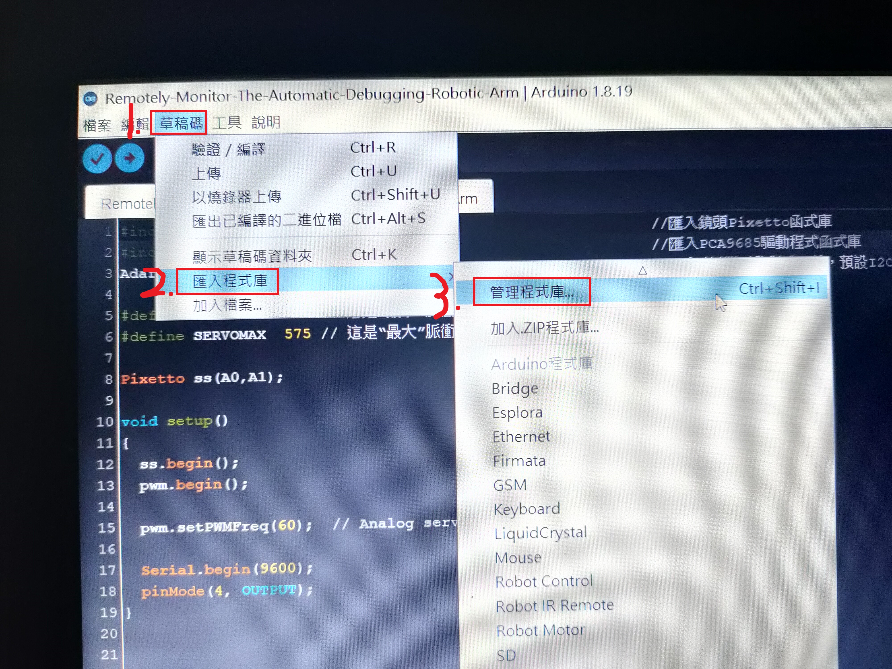
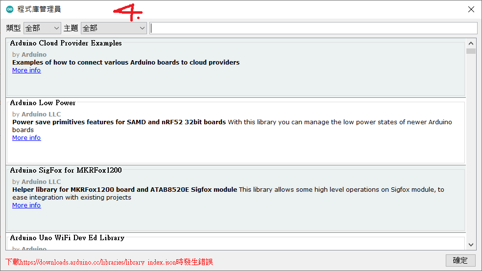

# Remotely-Monitor-The-Automatic-Debugging-Robotic-Arm

When the Pixetto lens determines that the object is the color of the defect, the conveyor belt stops running and the robotic arm clamps the place where the article is placed, and conversely, the conveyor belt runs, and the robotic arm presents its initial state

# Install

After following the first three steps below, please note that the image from step 4 must come out, otherwise you cannot enter the Pixetto and Adafruit PWM Servo Driver Library




# Usage
### Adafruit_PWMServoDriver pwm = Adafruit_PWMServoDriver()

Variable pwm controls the six-axis robotic arm motor

### Pixetto ss(A0,A1)

Variable ss control the Pixelto lens, where A0 and A1 are RX and TX pins, respectively

# Methods
### setPWMFreq(freq)
#### Description
This function can be used to adjust the PWM frequency, which determines how many full 'pulses' per second are generated by the IC. Stated differently, the frequency determines how 'long' each pulse is in duration from start to finish, taking into account both the high and low segments of the pulse.

Frequency is important in PWM, since setting the frequency too high with a very small duty cycle can cause problems, since the 'rise time' of the signal (the time it takes to go from 0V to VCC) may be longer than the time the signal is active, and the PWM output will appear smoothed out and may not even reach VCC, potentially causing a number of problems.

#### Arguments
freq: A number representing the frequency in Hz, between 40 and 1600
#### Example
The following code will set the PWM frequency to 1000Hz:
```C++
pwm.setPWMFreq(1000)
```
### setPWM(channel, on, off)
#### Description
This function sets the start (on) and end (off) of the high segment of the PWM pulse on a specific channel.  You specify the 'tick' value between 0..4095 when the signal will turn on, and when it will turn off.  Channel indicates which of the 16 PWM outputs should be updated with the new values.

#### Arguments
  * channel: The channel that should be updated with the new values (0..15)
  * on: The tick (between 0..4095) when the signal should transition from low to high
  * off:the tick (between 0..4095) when the signal should transition from high to low
#### Example
The following example will cause channel 15 to start low, go high around 25% into the pulse (tick 1024 out of 4096), transition back to low 75% into the pulse (tick 3072), and remain low for the last 25% of the pulse:
```C++
pwm.setPWM(15, 1024, 3072)
```

# License
(c) 2022 Qing Wei Lin. MIT License
