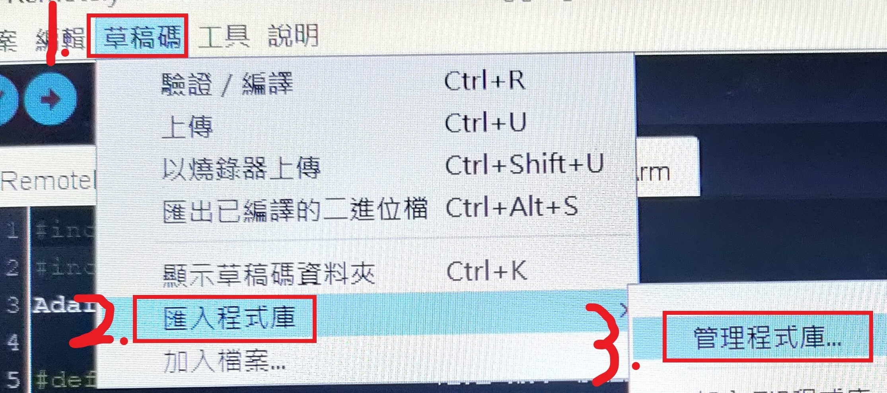

# Remotely-Monitor-The-Automatic-Debugging-Robotic-Arm

When the Pixetto lens determines that the object is the color of the defect, the conveyor belt stops running and the robotic arm clamps the place where the article is placed, and conversely, the conveyor belt runs, and the robotic arm presents its initial state

# Install

After following the image steps below, enter the Pixetto and Adafruit PWM Servo Driver Library

# License
(c) 2022 Qing Wei Lin. MIT License
